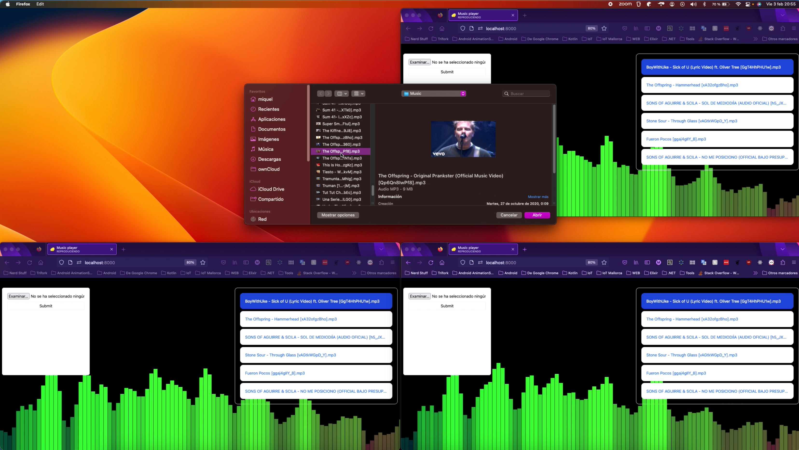

# Distributed music player application
Trifork Mallorca hackathon, 2023 edition.

<div align="center">
  
</div>

## Description 
We are going to build a music player system that allows users to add songs to a so called "playlist". Once they've added at least one song users will be able to select which song they would like to play from the playlist. This will update the state of the music player which will be propagated to all player applications.

## Objectives
- Have fun
- Have fun
- Have fun
- Have fun
- Have fun
- Have fun
- Have fun
- Work as small independent teams
- Perhaps learn a new piece of technology


## Features 
- Add song to the playlist*
- Display the playlist*
- Play a given song*
- Stop current song*
- Backend will play songs in order*
- Resume playing current song*
- Cool equaliser (the cooler the jumpy-bars more style-points)*
- Volume control
- Seek to a certain point in time in the song

<small>* fields are required to call the hackathon as completed :)</small>
## Interfacing specification

Payloads are **always** JSON strings except when uploading and downloading songs from the server in which case we'll be talking about `multipart/form-data` and `binary-blob`s.

### POST /api/player/songs

This endpoint adds a song to the playlist. Uploading songs with names that already exist will result in a 400. It takes a single `multipart/form-data` with a single `file` field holding `.mp3` file.

### GET /api/song/{song-name}

This endpoint will return a `Blob` with the contents of the song identified by it's file name or 404 if it does not exist.

### WS /api/player

This endpoint will stablish a two-way WebSocket connection.

#### Up-stream messages
The clients will be able to send commands to update the player's state. These commands have the following fields:

- (**mandatory**) `action`. String enum representing what to do. (`PlaySongAt`, `Stop`, `Resume`)
- (**nullable**) `payload`. Custom payload for the given command. Could be `{ songAt: 32 }` for the action `PlaySongAt`; `{volume: 10}` for a potential `SetVolume` action or `{second: 10}` for a `Seek` action.

Samples:

```json
{
    "action": "PlaySongAt",
    "payload": { "at": 0 }
}
```

```json
{
    "action": "Stop",
    "payload": null
}
```

```json
{
    "action": "Seek",
    "payload": { "second": 10 }
}
```

#### Down-stream messages

The server will broadcast to all clients the state of the player whenever it is suitable. _whenever suitable being_

- Whenever a client connects, it's getting the current "PlayerState"
- Whenever a song gets added to the playlist, the "PlayerState" gets updated and broadcasted
- Whenever a song finishes playing, the backend will produce a new "PlayerState" indicating that the next song has started playing.


With all this said here's the data-contract for the `PlayerState`

* (**required**) `playlist`: A list of `Song`s that belong to the player
* (**nullable**) `playingSong`: The song name that is currently playing or null if there isn't any.
* (**required**) `state`: A string enum with `"playing"` or `"paused"`, representing whether the player has been paused or it is currently playing.
* (**required**) `emittedAt`: Millisecond timestamp that represents the computation instant on the server. This is important due to Player apps synchronization.

Here's the data-contract for the `Song`:

* (**required**) `fileName`: The file name as a string to be passed to the `GET /api/songs/{song-name}` endpoint to download the blob.
* (**required**) `durationMS`: The song's duration in milliseconds.


The initial player state will be:

```json
{
  "playlist": [],
  "playingSong": null,
  "state": "paused",
  "emittedAt": "Whatever timestamp we get once we call Date.now() AS A NUMBER"
}
```


## Constraints **(only for mandatory features)**
- Keep dependencies to a minimum. We're building our own thing, not putting some example together. UI deps, HttpClient, HttpServer, WebSockets, testing and something to parse mp3 files should be enough. Depending on the stack maybe makes sense to add more
- All communication* will be handled in real time. This means that main mean of communication will be WebSocket based. <small>*all communication that doesn't involve uploading or downloading a song</small>
- Nothing happens locally. Whatever is sent from the backend is the only source of truth. No optimistic updates. **This also means that initial state of the app also comes from the backend.** This will also enable new clients to pick up the state from a playlist that is already playing
- Backend's and clients' source code goes into goes into this repository.

## Development
We're around 10 developers. We're going to screamble into two or three teams depending on the organisation. **RemoteController app**, **MusicPlayer app** and the **Server**. A **single developer cannot implement more than 10% of the tickets** on its own. Once it has reached its ticket quota it must sit down with another team member and do MOB programming. No pushing to master, everything must go through code review.

## Deliverables.
- Basic instructions on how to get started to mess with the source code
- Source code
- Readme file inside each project with instructions on how to produce **and distribute** the final binary.
- `screenshots/` folder if it makes sense


## Extras

- Add user support. People can enter a unique username which is going to be provided as an Authorization header and used to tag who uploaded which song. An endpoint to "create" such username will be provided
- Add the ability to have more than one playlist. Create them by tag "Metal", "Techno", "Indie")
- Show MP3's metadata on the player app. Show album picture, name, etc.